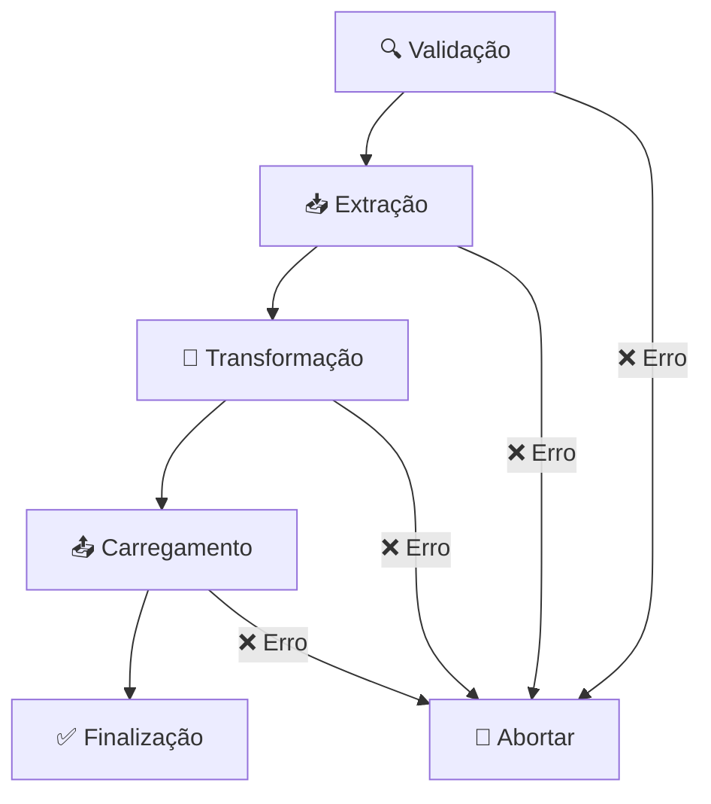

# 🏛️ Sistema ETL do Senado Federal - Versão 2.0


Sistema completo de **extração, transformação e carregamento (ETL)** para dados do Senado Federal brasileiro, totalmente refatorado com arquitetura modular e profissional.

---

## 📋 **Índice**

- [🚀 Visão Geral](#-visão-geral)
- [🏗️ Arquitetura](#️-arquitetura)
- [📦 Processadores Disponíveis](#-processadores-disponíveis)
- [🛠️ Instalação e Configuração](#️-instalação-e-configuração)
- [💻 Exemplos de Uso](#-exemplos-de-uso)
- [📊 Opções de Linha de Comando](#-opções-de-linha-de-comando)
- [🔧 Configurações Avançadas](#-configurações-avançadas)
- [📁 Estrutura do Projeto](#-estrutura-do-projeto)
- [🧪 Desenvolvimento](#-desenvolvimento)
- [🤝 Contribuição](#-contribuição)

---

## 🚀 **Visão Geral**

O **Sistema ETL do Senado Federal v2.0** é uma solução completa e modular para processamento de dados parlamentares. Com arquitetura baseada no padrão **Template Method**, oferece:

### ✨ **Características Principais**

- **🔄 Arquitetura Modular**: Cada processador é independente e reutilizável
- **📊 CLI Unificado**: Interface de linha de comando consistente para todos os processadores
- **🎯 Multi-destino**: Suporte a Firestore, Emulator e salvamento local (PC)
- **📈 Monitoramento**: Sistema completo de logs, progresso e estatísticas
- **🛡️ Validação**: Validações automáticas e tratamento de erros robusto
- **⚡ Performance**: Controle de concorrência e otimizações de API
- **🔧 Configurável**: Sistema de configuração centralizado e flexível

### 🎯 **Principais Funcionalidades**

- Processamento de **perfis completos** de senadores
- Extração de **comissões parlamentares** e suas composições
- Processamento de **lideranças parlamentares** e hierarquias
- Extração de **mesas diretoras** por período
- Listagem de **senadores em exercício** com filtros
- Processamento de **matérias legislativas** (autorias e relatorias)
- Extração de **votações** de senadores por legislatura
- Processamento de **blocos parlamentares** e membros
- Extração de **discursos** de senadores

---

## 🏗️ **Arquitetura**

O sistema segue uma arquitetura em camadas bem definida:

```
📁 scripts/
├── 🏛️ core/                    # Núcleo do sistema ETL
│   └── etl-processor.ts        # Classe base (Template Method)
├── 📋 types/                   # Definições de tipos TypeScript
│   └── etl.types.ts           # Interfaces e enums centralizados
├── ⚙️ config/                  # Configurações do sistema
│   ├── etl.config.ts          # Configurações principais
│   └── environment.config.ts   # Configurações de ambiente
├── 🔧 utils/                   # Utilitários compartilhados
│   ├── cli/                   # Sistema de CLI
│   ├── logging/               # Sistema de logs
│   ├── storage/               # Conectores de armazenamento
│   └── common/                # Utilitários gerais
├── 🎯 processors/              # Processadores específicos
│   ├── perfil-senadores.processor.ts
│   ├── comissoes.processor.ts
│   ├── liderancas.processor.ts
│   ├── mesas.processor.ts
│   ├── senadores.processor.ts
│   ├── materias.processor.ts
│   ├── votacoes.processor.ts
│   ├── blocos.processor.ts
│   └── discursos.processor.ts
├── 🚀 initiators/              # Scripts executáveis
│   ├── processar_perfilsenadores.ts
│   ├── processar_comissoes.ts
│   ├── processar_liderancas.ts
│   └── [outros processadores...]
├── 📥 extracao/                # Módulos de extração
├── 🔄 transformacao/           # Módulos de transformação
└── 📤 carregamento/            # Módulos de carregamento
```

### 🔄 **Fluxo ETL Padrão**

Todos os processadores seguem o mesmo fluxo:



---

## 📦 **Processadores Disponíveis**

### 🏛️ **Principais Processadores**

| Processador | Comando | Descrição | Status |
|-------------|---------|-----------|--------|
| **Perfis de Senadores** | `senado:perfil` | Perfis completos com mandatos, filiacoes e histórico | ✅ |
| **Comissões** | `senado:comissoes` | Comissões parlamentares e suas composições | ✅ |
| **Lideranças** | `senado:liderancas` | Lideranças parlamentares e hierarquias | ✅ |
| **Mesas Diretoras** | `senado:mesas` | Mesas diretoras por período | ✅ |
| **Senadores** | `senado:senadores` | Senadores em exercício | ✅ |
| **Matérias Legislativas** | `senado:materias` | Autorias e relatorias de matérias | ✅ |
| **Votações** | `senado:votacoes` | Votações de senadores por legislatura | ✅ |
| **Blocos Parlamentares** | `senado:blocos` | Blocos parlamentares e membros | ✅ |
| **Discursos** | `senado:discursos` | Discursos de senadores | ✅ |

---

## 🛠️ **Instalação e Configuração**

### 📋 **Pré-requisitos**

- **Node.js** 16.0 ou superior
- **TypeScript** 5.0 ou superior
- **Firestore** (opcional, para produção)

### ⚙️ **Configuração Inicial**

1. **Configure as variáveis de ambiente**:
   ```bash
   cp .env.example .env
   ```

2. **Configure o `.env`**:
   ```bash
   # Configurações do Firestore
   GOOGLE_APPLICATION_CREDENTIALS=./config/serviceAccountKey.json
   FIRESTORE_PROJECT_ID=seu-projeto-id
   
   # Emulador (opcional)
   FIRESTORE_EMULATOR_HOST=127.0.0.1:8080
   
   # Configurações de logs
   LOG_LEVEL=info
   
   # Configurações de API
   SENADO_API_BASE_URL=https://legis.senado.leg.br
   ```

3. **Instale as dependências** (se necessário):
   ```bash
   npm install
   ```

---

## 💻 **Exemplos de Uso**

### 🏛️ **Processador de Perfis de Senadores**

```bash
# Processar legislatura atual
npm run senado:perfil

# Legislatura específica com limite
npm run senado:perfil -- 57 --limite 10

# Salvar no PC com logs detalhados
npm run senado:perfil -- --pc --verbose

# Usar Firestore Emulator
npm run senado:perfil -- --emulator

# Senador específico
npm run senado:perfil -- --senador 5012
```

### 🏛️ **Processador de Comissões**

```bash
# Todas as comissões da legislatura atual
npm run senado:comissoes

# Legislatura específica limitada
npm run senado:comissoes -- 57 --limite 5

# Com composições incluídas
npm run senado:comissoes -- --incluir-composicoes

# Tipo específico de comissão
npm run senado:comissoes -- --tipo-comissao PERMANENTE
```

### 👑 **Processador de Lideranças**

```bash
# Todas as lideranças
npm run senado:liderancas

# Com membros incluídos
npm run senado:liderancas -- --incluir-membros

# Tipo específico de liderança
npm run senado:liderancas -- --tipo-lideranca GOVERNO
```

### 🗳️ **Processador de Votações**

```bash
# ⚠️ Votações requerem legislatura específica!
npm run senado:votacoes -- 57

# Senador específico
npm run senado:votacoes -- 53 --senador 123

# Limitado a poucos senadores
npm run senado:votacoes -- 56 --limite 5
```

### 📋 **Processador de Matérias Legislativas**

```bash
# Todas as matérias da legislatura atual
npm run senado:materias

# Senador específico
npm run senado:materias -- --senador 123

# Limitado
npm run senado:materias -- --limite 10

# Tipo específico
npm run senado:materias -- --tipo-materia PLS
```

---

## 📊 **Opções de Linha de Comando**

### 🎯 **Opções Universais**

Todas as funções suportam essas opções:

| Opção | Atalho | Descrição | Exemplo |
|-------|--------|-----------|---------|
| `--legislatura <num>` | `--57` | Legislatura específica | `--57` ou `--legislatura 57` |
| `--limite <num>` | `-l <num>` | Limitar registros processados | `--limite 10` |
| `--senador <código>` | `-s <código>` | Senador específico | `--senador 5012` |
| `--partido <sigla>` | `-p <sigla>` | Filtrar por partido | `--partido PT` |
| `--uf <sigla>` | `-u <sigla>` | Filtrar por UF | `--uf SP` |
| `--firestore` | | Salvar no Firestore de produção | `--firestore` |
| `--emulator` | | Usar Firestore Emulator | `--emulator` |
| `--pc` | | Salvar apenas no PC local | `--pc` |
| `--verbose` | `-v` | Logs detalhados | `--verbose` |
| `--dry-run` | | Executar sem salvar | `--dry-run` |
| `--force` | `-f` | Forçar reprocessamento | `--force` |
| `--help` | `-h` | Mostrar ajuda | `--help` |

### 🎯 **Opções Específicas por Processador**

#### 🏛️ **Perfis de Senadores**
- `--historico`: Incluir histórico completo
- `--fotos`: Incluir URLs de fotos

#### 🏛️ **Comissões**
- `--incluir-composicoes`: Incluir membros das comissões
- `--tipo-comissao <tipo>`: Filtrar por tipo (PERMANENTE, TEMPORARIA, etc.)

#### 👑 **Lideranças**
- `--incluir-membros`: Incluir membros das lideranças
- `--tipo-lideranca <tipo>`: Filtrar por tipo (GOVERNO, OPOSICAO, etc.)

#### 💬 **Discursos**
- `--tipo <tipo>`: Tipo de discurso
- `--palavras-chave <lista>`: Palavras-chave separadas por vírgula
- `--data-inicio <data>`: Data inicial (YYYY-MM-DD)
- `--data-fim <data>`: Data final (YYYY-MM-DD)

---

## 🔧 **Configurações Avançadas**

### ⚙️ **Arquivo de Configuração**

O arquivo `config/etl.config.ts` permite ajustar:

```typescript
export const etlConfig: ETLConfig = {
  senado: {
    concurrency: 3,          // Requisições simultâneas
    maxRetries: 3,           // Tentativas por requisição
    timeout: 30000,          // Timeout em ms
    pauseBetweenRequests: 1000, // Pausa entre requisições
    legislatura: {
      min: 1,
      max: 58,
      atual: 57
    }
  },
  firestore: {
    batchSize: 500,          // Tamanho do batch
    pauseBetweenBatches: 2000, // Pausa entre batches
    emulatorHost: 'localhost:8080'
  },
  export: {
    baseDir: './exports',    // Diretório de exportação
    formats: ['json'],       // Formatos suportados
    compression: false       // Compressão de arquivos
  },
  logging: {
    level: 'info',          // Nível de log
    includeTimestamp: true,  // Incluir timestamp
    colorize: true          // Colorir logs
  }
};
```

### 🎯 **Destinos de Dados**

O sistema suporta múltiplos destinos:

#### ☁️ **Firestore de Produção**
```bash
# Configurar credenciais
export GOOGLE_APPLICATION_CREDENTIALS=./config/serviceAccountKey.json

# Executar
npm run senado:perfil -- --firestore
```

#### 🧪 **Firestore Emulator**
```bash
# Iniciar emulador
firebase emulators:start --only firestore

# Executar processador
npm run senado:perfil -- --emulator
```

#### 💾 **Salvamento Local (PC)**
```bash
# Salvar apenas localmente
npm run senado:perfil -- --pc

# Arquivos salvos em: ./exports/
```

---

## 📁 **Estrutura do Projeto**

### 📊 **Métricas do Sistema**

- **✅ 9 processadores** completamente funcionais
- **🔧 13 scripts initiators** refatorados
- **📦 100+ módulos** organizados em camadas
- **🎯 Sistema CLI unificado** com 15+ opções
- **📋 TypeScript 100%** com tipagem forte
- **🛡️ Validação completa** em todas as camadas

### 🗂️ **Estrutura Detalhada**

```
📁 senado_api_wrapper/
├── 📋 config/
│   ├── etl.config.ts              # Configurações principais
│   ├── environment.config.ts       # Configurações de ambiente
│   └── index.ts
├── 🏛️ core/
│   └── etl-processor.ts           # Classe base ETL
├── 📊 types/
│   ├── etl.types.ts               # Tipos centralizados
│   └── index.ts
├── 🔧 utils/
│   ├── cli/
│   │   ├── etl-cli.ts             # Parser CLI unificado
│   │   ├── args-parser.ts
│   │   └── index.ts
│   ├── logging/
│   │   ├── logger.ts
│   │   ├── error-handler.ts
│   │   └── index.ts
│   ├── storage/
│   │   ├── firestore/
│   │   └── index.ts
│   ├── api/
│   │   ├── client.ts
│   │   ├── endpoints.ts
│   │   └── index.ts
│   ├── common/
│   │   ├── data-exporter.ts
│   │   └── index.ts
│   └── date/
│       ├── legislatura.ts
│       └── index.ts
├── 🎯 processors/
│   ├── perfil-senadores.processor.ts  ✅
│   ├── comissoes.processor.ts         ✅
│   ├── liderancas.processor.ts        ✅
│   ├── mesas.processor.ts             ✅
│   ├── senadores.processor.ts         ✅
│   ├── materias.processor.ts          ✅
│   ├── votacoes.processor.ts          ✅
│   ├── blocos.processor.ts            ✅
│   ├── discursos.processor.ts         ✅
│   ├── template.processor.ts
│   └── index.ts
├── 🚀 initiators/
│   ├── processar_perfilsenadores.ts   ✅
│   ├── processar_comissoes.ts         ✅
│   ├── processar_liderancas.ts        ✅
│   ├── processar_mesas.ts             ✅
│   ├── processar_senadores.ts         ✅
│   ├── processar_materias.ts          ✅
│   ├── processar_votacoes.ts          ✅
│   ├── processar_blocos.ts            ✅
│   ├── processar_discursos.ts         ✅
│   └── [arquivos .bak dos antigos]
├── 📥 extracao/
│   ├── perfilsenadores.ts
│   ├── comissoes.ts
│   ├── liderancas.ts
│   ├── mesas.ts
│   ├── senadores.ts
│   ├── materias.ts
│   ├── votacoes.ts
│   ├── blocos.ts
│   └── discursos.ts
├── 🔄 transformacao/
│   ├── perfilsenadores.ts
│   ├── comissoes.ts
│   ├── liderancas.ts
│   ├── mesas.ts
│   ├── senadores.ts
│   ├── materias.ts
│   ├── votacoes.ts
│   ├── blocos.ts
│   └── discursos.ts
├── 📤 carregamento/
│   ├── perfilsenadores.ts
│   ├── comissoes.ts
│   ├── liderancas.ts
│   ├── mesas.ts
│   ├── senadores.ts
│   ├── materias.ts
│   ├── votacoes.ts
│   ├── blocos.ts
│   └── discursos.ts
├── 📋 index.ts
├── 📄 README.md
├── 🧪 test-etl-system.ts
├── 📖 migration-guide.ts
└── 🌍 .env.example
```

---

## 🧪 **Desenvolvimento**

### 🛠️ **Criando um Novo Processador**

1. **Use o template**:
   ```typescript
   import { TemplateProcessor } from './processors/template.processor';
   ```

2. **Implemente os métodos abstratos**:
   ```typescript
   export class MeuProcessor extends ETLProcessor<ExtractedData, TransformedData> {
     protected getProcessName(): string {
       return 'Meu Processador Personalizado';
     }
     
     async validate(): Promise<ValidationResult> { /* ... */ }
     async extract(): Promise<ExtractedData> { /* ... */ }
     async transform(data: ExtractedData): Promise<TransformedData> { /* ... */ }
     async load(data: TransformedData): Promise<BatchResult> { /* ... */ }
   }
   ```

3. **Crie o script initiator**:
   ```typescript
   import { MeuProcessor } from '../processors/meu.processor';
   // Siga o padrão dos outros initiators
   ```

### 🧪 **Testes**

```bash
# Testar sistema completo
npm run test-etl

# Testar processador específico em dry-run
npm run senado:perfil -- --dry-run --verbose

# Testar com limite pequeno
npm run senado:perfil -- --limite 1 --verbose
```

### 📊 **Monitoramento**

O sistema oferece logs detalhados em múltiplos níveis:

```bash
# Debug completo
npm run senado:perfil -- --verbose

# Apenas erros
LOG_LEVEL=error npm run senado:perfil

# Logs coloridos (padrão)
LOG_COLORIZE=true npm run senado:perfil
```

---

## 🤝 **Contribuição**

### 🎯 **Diretrizes de Desenvolvimento**

1. **Siga o padrão ETL**: Use a classe base `ETLProcessor`
2. **TypeScript first**: Tipagem forte obrigatória
3. **Logs consistentes**: Use o sistema de logging unificado
4. **Validação rigorosa**: Implemente validações robustas
5. **Documentação**: Comente código complexo
6. **Testes**: Teste com `--dry-run` antes de produção

### 📋 **Checklist para Novos Processadores**

- [ ] Estende `ETLProcessor<T, U>`
- [ ] Implementa todos os métodos abstratos
- [ ] Usa `ETLCommandParser` para CLI
- [ ] Tem validações de entrada
- [ ] Suporta múltiplos destinos
- [ ] Emite eventos de progresso
- [ ] Tem logs informativos
- [ ] Documentação completa
- [ ] Testes funcionais

---

## 📚 **Recursos Adicionais**

### 🔗 **Links Úteis**

- [Documentação da API do Senado](https://legis.senado.leg.br/dadosabertos/)
- [Firestore Documentation](https://firebase.google.com/docs/firestore)
- [TypeScript Handbook](https://www.typescriptlang.org/docs/)

### 📧 **Suporte**

Para questões sobre o sistema ETL:

1. **Consulte esta documentação**
2. **Verifique os logs com `--verbose`**
3. **Teste com `--dry-run` primeiro**
4. **Use `--help` para opções específicas**

---

## 📄 **Licença**

Este projeto está licenciado sob a licença MIT. Veja o arquivo `LICENSE` para detalhes.

---

## 🎉 **Conclusão**

O **Sistema ETL do Senado Federal v2.0** oferece uma solução robusta, escalável e profissional para processamento de dados parlamentares. Com sua arquitetura modular e interface unificada, facilita tanto o uso cotidiano quanto o desenvolvimento de novos processadores.

**✨ Principais benefícios da refatoração:**

- 🔄 **Reutilização**: CLI e validações compartilhadas
- 🛡️ **Confiabilidade**: Tratamento robusto de erros
- 📊 **Monitoramento**: Logs e progresso detalhados
- ⚡ **Performance**: Otimizações e controle de concorrência
- 🧪 **Testabilidade**: Modo dry-run e validações
- 📚 **Documentação**: Guias completos e exemplos

**🚀 Pronto para uso em produção!**

---

*Documentação atualizada em: $(date)*
*Versão: 2.0*
*Sistema ETL do Senado Federal - Arquitetura Modular*
