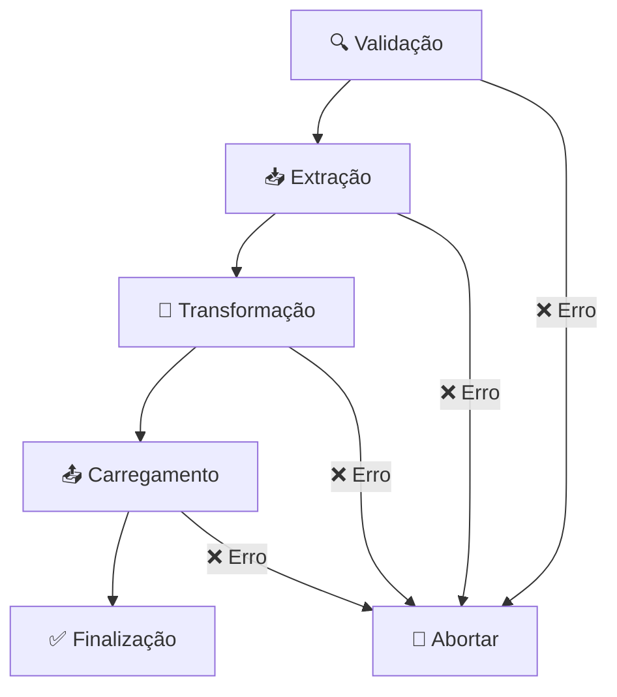

# 🏛️ Sistema ETL da Câmara dos Deputados - Versão 2.0


Sistema completo de **extração, transformação e carregamento (ETL)** para dados da Câmara dos Deputados brasileira, totalmente refatorado com arquitetura modular e profissional.

---

## 📋 **Índice**

- [🚀 Visão Geral](#-visão-geral)
- [🏗️ Arquitetura](#️-arquitetura)
- [📦 Processadores Disponíveis](#-processadores-disponíveis)
- [🛠️ Instalação e Configuração](#️-instalação-e-configuração)
- [💻 Exemplos de Uso](#-exemplos-de-uso)
- [📊 Opções de Linha de Comando](#-opções-de-linha-de-comando)
- [🔧 Configurações Avançadas](#-configurações-avançadas)
- [📁 Estrutura do Projeto](#-estrutura-do-projeto)
- [🧪 Desenvolvimento](#-desenvolvimento)
- [🤝 Contribuição](#-contribuição)

---

## 🚀 **Visão Geral**

O **Sistema ETL da Câmara dos Deputados v2.0** é uma solução completa e modular para processamento de dados parlamentares. Com arquitetura baseada no padrão **Template Method**, oferece:

### ✨ **Características Principais**

- **🔄 Arquitetura Modular**: Cada processador é independente e reutilizável
- **📊 CLI Unificado**: Interface de linha de comando consistente para todos os processadores
- **🎯 Multi-destino**: Suporte a Firestore, Emulator e salvamento local (PC)
- **📈 Monitoramento**: Sistema completo de logs, progresso e estatísticas
- **🛡️ Validação**: Validações automáticas e tratamento de erros robusto
- **⚡ Performance**: Controle de concorrência e otimizações de API
- **🔧 Configurável**: Sistema de configuração centralizado e flexível

### 🎯 **Principais Funcionalidades**

- Processamento de **perfis completos** de deputados
- Extração de **despesas parlamentares** com paginação automática
- Processamento de **discursos** de deputados por período
- Suporte a **modo incremental** para atualizações eficientes
- Validações automáticas de dados e parâmetros
- Sistema de **batches inteligentes** para grandes volumes

---

## 🏗️ **Arquitetura**

O sistema segue uma arquitetura em camadas bem definida:

```
📁 scripts/
├── 🏛️ core/                    # Núcleo do sistema ETL
│   └── etl-processor.ts        # Classe base (Template Method)
├── 📋 types/                   # Definições de tipos TypeScript
│   └── etl.types.ts           # Interfaces e enums centralizados
├── ⚙️ config/                  # Configurações do sistema
│   ├── etl.config.ts          # Configurações principais
│   └── environment.config.ts   # Configurações de ambiente
├── 🔧 utils/                   # Utilitários compartilhados
│   ├── cli/                   # Sistema de CLI
│   ├── logging/               # Sistema de logs
│   ├── storage/               # Conectores de armazenamento
│   ├── api/                   # Cliente HTTP e endpoints
│   └── common/                # Utilitários gerais
├── 🎯 processors/              # Processadores específicos
│   ├── perfil-deputados.processor.ts
│   ├── despesas-deputados.processor.ts
│   └── discursos-deputados.processor.ts
├── 🚀 initiators/              # Scripts executáveis
│   ├── processar_perfildeputados_v2.ts
│   ├── processar_despesasdeputados_v2.ts
│   └── processar_discursosdeputados_v2.ts
├── 📥 extracao/                # Módulos de extração (legado)
├── 🔄 transformacao/           # Módulos de transformação (legado)
└── 📤 carregamento/            # Módulos de carregamento (legado)
```

### 🔄 **Fluxo ETL Padrão**

Todos os processadores seguem o mesmo fluxo:



---

## 📦 **Processadores Disponíveis**

### 🏛️ **Processadores Implementados**

| Processador | Comando | Descrição | Status |
|-------------|---------|-----------|--------|
| **Perfis de Deputados** | `camara:perfil` | Perfis completos com mandatos e filiações | ✅ |
| **Despesas de Deputados** | `camara:despesas` | Despesas parlamentares com paginação | ✅ |
| **Discursos de Deputados** | `camara:discursos` | Discursos por período e palavras-chave | ✅ |

---

## 🛠️ **Instalação e Configuração**

### 📋 **Pré-requisitos**

- **Node.js** 16.0 ou superior
- **TypeScript** 5.0 ou superior
- **Firestore** (opcional, para produção)

### ⚙️ **Configuração Inicial**

1. **Configure as variáveis de ambiente**:
   ```bash
   cp .env.example .env
   ```

2. **Configure o `.env`**:
   ```bash
   # Configurações do Firestore
   GOOGLE_APPLICATION_CREDENTIALS=./config/serviceAccountKey.json
   FIRESTORE_PROJECT_ID=seu-projeto-id
   
   # Emulador (opcional)
   FIRESTORE_EMULATOR_HOST=127.0.0.1:8080
   
   # Configurações de logs
   LOG_LEVEL=info
   
   # Configurações de API
   CAMARA_API_BASE_URL=https://dadosabertos.camara.leg.br/api/v2
   ```

3. **Teste o sistema**:
   ```bash
   npm run test-etl
   ```

---

## 💻 **Exemplos de Uso**

### 👤 **Processador de Perfis de Deputados**

```bash
# Processar legislatura atual
npm run camara:perfil

# Legislatura específica com limite
npm run camara:perfil -- 57 --limite 10

# Incluir mandatos e filiações
npm run camara:perfil -- --incluir-mandatos --incluir-filiacoes

# Salvar no PC com logs detalhados
npm run camara:perfil -- --pc --verbose

# Usar Firestore Emulator
npm run camara:perfil -- --emulator

# Deputado específico
npm run camara:perfil -- --deputado 123456
```

### 💰 **Processador de Despesas de Deputados**

```bash
# ⚠️ Despesas requerem legislatura específica!
npm run camara:despesas -- 57

# Filtrar por ano e mês
npm run camara:despesas -- 57 --ano 2024 --mes 6

# Modo atualização incremental (últimos 60 dias)
npm run camara:despesas -- 57 --atualizar

# Deputado específico
npm run camara:despesas -- 57 --deputado 123456

# Limitado a poucos deputados
npm run camara:despesas -- 57 --limite 5
```

### 🎤 **Processador de Discursos de Deputados**

```bash
# ⚠️ Discursos requerem legislatura específica!
npm run camara:discursos -- 57

# Filtrar por período
npm run camara:discursos -- 57 --data-inicio 2024-01-01 --data-fim 2024-06-30

# Modo atualização incremental (últimos 60 dias)
npm run camara:discursos -- 57 --atualizar

# Buscar por palavras-chave
npm run camara:discursos -- 57 --palavras-chave "educação,saúde,tecnologia"

# Deputado específico
npm run camara:discursos -- 57 --deputado 123456
```

---

## 📊 **Opções de Linha de Comando**

### 🎯 **Opções Universais**

Todas as funções suportam essas opções:

| Opção | Atalho | Descrição | Exemplo |
|-------|--------|-----------|---------|
| `--legislatura <num>` | `--57` | Legislatura específica | `--57` ou `--legislatura 57` |
| `--limite <num>` | `-l <num>` | Limitar registros processados | `--limite 10` |
| `--deputado <código>` | `-d <código>` | Deputado específico | `--deputado 123456` |
| `--partido <sigla>` | `-p <sigla>` | Filtrar por partido | `--partido PT` |
| `--uf <sigla>` | `-u <sigla>` | Filtrar por UF | `--uf SP` |
| `--firestore` | | Salvar no Firestore de produção | `--firestore` |
| `--emulator` | | Usar Firestore Emulator | `--emulator` |
| `--pc` | | Salvar apenas no PC local | `--pc` |
| `--verbose` | `-v` | Logs detalhados | `--verbose` |
| `--dry-run` | | Executar sem salvar | `--dry-run` |
| `--force` | `-f` | Forçar reprocessamento | `--force` |
| `--help` | `-h` | Mostrar ajuda | `--help` |

### 🎯 **Opções Específicas por Processador**

#### 👤 **Perfis de Deputados**
- `--incluir-mandatos`: Incluir histórico de mandatos
- `--incluir-filiacoes`: Incluir histórico de filiações partidárias
- `--incluir-fotos`: Incluir URLs de fotos

#### 💰 **Despesas de Deputados**
- `--ano <ano>`: Filtrar por ano específico (ex: 2024)
- `--mes <mes>`: Filtrar por mês específico (1-12)
- `--atualizar`: Modo atualização incremental (últimos 60 dias)

#### 🎤 **Discursos de Deputados**
- `--data-inicio <data>`: Data inicial (YYYY-MM-DD)
- `--data-fim <data>`: Data final (YYYY-MM-DD)
- `--palavras-chave <lista>`: Palavras-chave separadas por vírgula
- `--tipo <tipo>`: Tipo específico de discurso
- `--atualizar`: Modo atualização incremental (últimos 60 dias)

---

## 🔧 **Configurações Avançadas**

### ⚙️ **Arquivo de Configuração**

O arquivo `config/etl.config.ts` permite ajustar:

```typescript
export const etlConfig: ETLConfig = {
  camara: {
    concurrency: 3,          // Requisições simultâneas
    maxRetries: 3,           // Tentativas por requisição
    timeout: 30000,          // Timeout em ms
    pauseBetweenRequests: 1000, // Pausa entre requisições
    legislatura: {
      min: 50,
      max: 57,
      atual: 57
    }
  },
  firestore: {
    batchSize: 500,          // Tamanho do batch
    pauseBetweenBatches: 2000, // Pausa entre batches
    emulatorHost: 'localhost:8080'
  },
  export: {
    baseDir: './exports',    // Diretório de exportação
    formats: ['json'],       // Formatos suportados
    compression: false       // Compressão de arquivos
  },
  logging: {
    level: 'info',          // Nível de log
    includeTimestamp: true,  // Incluir timestamp
    colorize: true          // Colorir logs
  }
};
```

### 🎯 **Destinos de Dados**

O sistema suporta múltiplos destinos:

#### ☁️ **Firestore de Produção**
```bash
# Configurar credenciais
export GOOGLE_APPLICATION_CREDENTIALS=./config/serviceAccountKey.json

# Executar
npm run camara:perfil -- --firestore
```

#### 🧪 **Firestore Emulator**
```bash
# Iniciar emulador
firebase emulators:start --only firestore

# Executar processador
npm run camara:perfil -- --emulator
```

#### 💾 **Salvamento Local (PC)**
```bash
# Salvar apenas localmente
npm run camara:perfil -- --pc

# Arquivos salvos em: ./exports/
```

---

## 📁 **Estrutura do Projeto**

### 📊 **Métricas do Sistema**

- **✅ 3 processadores** completamente funcionais
- **🔧 3 scripts initiators** refatorados
- **📦 100+ módulos** organizados em camadas
- **🎯 Sistema CLI unificado** com 15+ opções
- **📋 TypeScript 100%** com tipagem forte
- **🛡️ Validação completa** em todas as camadas

### 🗂️ **Estrutura Detalhada**

```
📁 camara_api_wrapper/
├── 📋 config/
│   ├── etl.config.ts              # Configurações principais
│   ├── environment.config.ts       # Configurações de ambiente
│   └── endpoints.ts               # Endpoints da API
├── 🏛️ core/
│   └── etl-processor.ts           # Classe base ETL
├── 📊 types/
│   ├── etl.types.ts               # Tipos centralizados
│   └── index.ts
├── 🔧 utils/
│   ├── cli/
│   │   ├── etl-cli.ts             # Parser CLI unificado
│   │   ├── args-parser.ts
│   │   └── index.ts
│   ├── logging/
│   │   ├── logger.ts
│   │   ├── error-handler.ts
│   │   └── index.ts
│   ├── storage/
│   │   ├── firestore/
│   │   └── index.ts
│   ├── api/
│   │   ├── client.ts
│   │   ├── endpoints.ts
│   │   └── index.ts
│   ├── common/
│   │   ├── data-exporter.ts
│   │   └── index.ts
│   └── date/
│       ├── legislatura.ts
│       └── index.ts
├── 🎯 processors/
│   ├── perfil-deputados.processor.ts     ✅
│   ├── despesas-deputados.processor.ts   ✅
│   ├── discursos-deputados.processor.ts  ✅
│   └── index.ts
├── 🚀 initiators/
│   ├── processar_perfildeputados_v2.ts   ✅
│   ├── processar_despesasdeputados_v2.ts ✅
│   ├── processar_discursosdeputados_v2.ts ✅
│   └── [arquivos antigos .ts]            📦
├── 📥 extracao/                  # Módulos extração (legado)
├── 🔄 transformacao/             # Módulos transformação (legado)
├── 📤 carregamento/              # Módulos carregamento (legado)
├── 📄 README.md                  # Documentação completa
├── 📖 migration-guide.md         # Guia de migração
└── 🧪 test-etl-system.ts        # Sistema de testes
```

---

## 🧪 **Desenvolvimento**

### 🛠️ **Testando o Sistema**

```bash
# Testar sistema completo
npm run test-etl

# Testar processador específico em dry-run
npm run camara:perfil -- --dry-run --verbose --limite 1

# Testar com limite pequeno
npm run camara:despesas -- 57 --limite 1 --pc --verbose
```

### 🔍 **Debug e Troubleshooting**

```bash
# Debug completo
npm run camara:perfil -- --verbose

# Apenas erros
LOG_LEVEL=error npm run camara:perfil

# Logs coloridos (padrão)
LOG_COLORIZE=true npm run camara:perfil

# Ver opções disponíveis
npm run camara:perfil -- --help
```

### 📊 **Monitoramento**

O sistema oferece logs detalhados em múltiplos níveis:

```bash
🚀 Processador de Perfis de Deputados
📋 Etapa 1/4: Validação
📥 Etapa 2/4: Extração
🔄 Etapa 3/4: Transformação  
📤 Etapa 4/4: Carregamento
✅ Processamento concluído

📊 RESULTADO:
✅ Sucessos: 10
❌ Falhas: 0
⚠️ Avisos: 2
⏱️ Tempo total: 45.32s
💾 Destino: Firestore Real
```

---

## 🤝 **Contribuição**

### 🎯 **Diretrizes de Desenvolvimento**

1. **Siga o padrão ETL**: Use a classe base `ETLProcessor`
2. **TypeScript first**: Tipagem forte obrigatória
3. **Logs consistentes**: Use o sistema de logging unificado
4. **Validação rigorosa**: Implemente validações robustas
5. **Documentação**: Comente código complexo
6. **Testes**: Teste com `--dry-run` antes de produção

### 📋 **Checklist para Novos Processadores**

- [ ] Estende `ETLProcessor<T, U>`
- [ ] Implementa todos os métodos abstratos
- [ ] Usa `ETLCommandParser` para CLI
- [ ] Tem validações de entrada
- [ ] Suporta múltiplos destinos
- [ ] Emite eventos de progresso
- [ ] Tem logs informativos
- [ ] Documentação completa
- [ ] Testes funcionais

---

## 📚 **Recursos Adicionais**

### 🔗 **Links Úteis**

- [Documentação da API da Câmara](https://dadosabertos.camara.leg.br/swagger/api.html)
- [Firestore Documentation](https://firebase.google.com/docs/firestore)
- [TypeScript Handbook](https://www.typescriptlang.org/docs/)

### 📧 **Suporte**

Para questões sobre o sistema ETL:

1. **Consulte esta documentação**
2. **Execute**: `npm run test-etl`
3. **Verifique os logs com `--verbose`**
4. **Teste com `--dry-run` primeiro**
5. **Use `--help` para opções específicas**

---

## 📄 **Licença**

Este projeto está licenciado sob a licença MIT. Veja o arquivo `LICENSE` para detalhes.

---

## 🎉 **Conclusão**

O **Sistema ETL da Câmara dos Deputados v2.0** oferece uma solução robusta, escalável e profissional para processamento de dados parlamentares. Com sua arquitetura modular e interface unificada, facilita tanto o uso cotidiano quanto o desenvolvimento de novos processadores.

**✨ Principais benefícios da refatoração:**

- 🔄 **Reutilização**: CLI e validações compartilhadas
- 🛡️ **Confiabilidade**: Tratamento robusto de erros
- 📊 **Monitoramento**: Logs e progresso detalhados
- ⚡ **Performance**: Otimizações e controle de concorrência
- 🧪 **Testabilidade**: Modo dry-run e validações
- 📚 **Documentação**: Guias completos e exemplos

**🚀 Pronto para uso em produção!**

### 🎯 **Próximos Passos**

1. **🧪 Execute os testes**: `npm run test-etl`
2. **⚙️ Configure credenciais** no arquivo `.env`
3. **🔍 Teste com dry-run**: `npm run camara:perfil -- --dry-run --limite 1`
4. **📊 Execute processamento real**: `npm run camara:perfil -- --pc --limite 5`
5. **🚀 Use em produção**: `npm run camara:perfil -- --firestore`

---

*Documentação atualizada em: $(date)*
*Versão: 2.0*
*Sistema ETL da Câmara dos Deputados - Arquitetura Modular*
